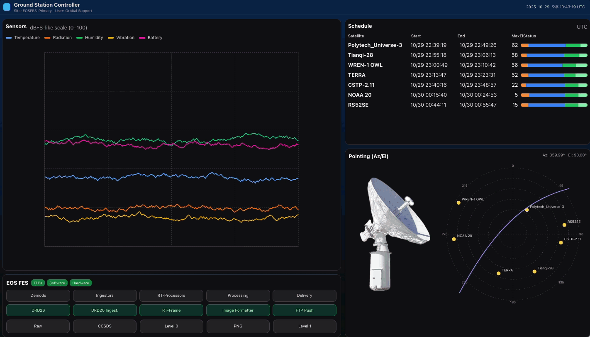

# 🛰️ GS Visual — Ground Station Dashboard

> 실시간 위성 지상국 운영 상황을 한눈에 시각화하는 대시보드입니다.  
> Pointing (Az/El), 센서 상태, 위성 스케줄, EOS FES 프로세스 등 주요 정보를 직관적으로 표현합니다.

---

## 🚀 DEMO



---

## 🧩 주요 기능

- **Pointing (Az/El) View**  
  - 실시간 안테나 방위각 및 고도각 표시  
  - 위성 궤적 및 다중 타겟 렌더링  

- **Sensors Visualization**  
  - 온도, 방사선량, 습도, 진동 등의 시계열 그래프  
  - 랜덤 스파이크를 통한 변동 시뮬레이션  

- **Schedule Table**  
  - 위성별 통신 일정 및 처리 상태 표시  
  - setup / tracking / processing / delivery 단계 구분  

- **EOS FES 모듈**  
  - 실시간 프로세스 상태 표시 (DRD26, RT-Frame 등)  
  - 데이터 처리 단계별 버튼/상태 시각화  

---

## 🛠️ 기술 스택

| 구성요소 | 사용 기술 |
|-----------|------------|
| Frontend Framework | React 18 (CRA or Vite) |
| UI Styling | TailwindCSS + Custom Inline Styles |
| Chart Rendering | SVG 기반 Custom Line/Polar Plot |
| Build Tool | react-scripts / vite |
| Language | JavaScript (ES6+) |

---

## 📦 설치 및 실행

```bash
# 1. 클론
git clone https://github.com/Gyeongje/gs_visual.git
cd gs_visual

# 2. 패키지 설치
npm install

# 3. 실행
npm start
